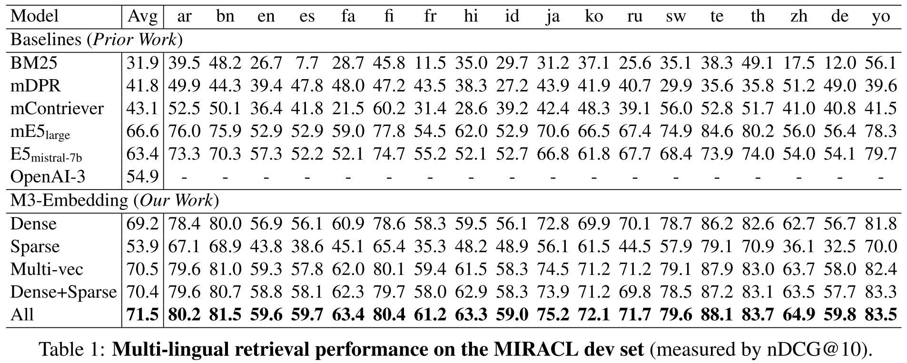

# BGE-M3
In this project, we introduce BGE-M3, which is distinguished for its versatility in Multi-Functionality, Multi-Linguality, and Multi-Granularity. 
- Multi-Functionality: It can simultaneously perform the three common retrieval functionalities of embedding model: dense retrieval, multi-vector retrieval, and sparse retrieval. 
- Multi-Linguality: It can support more than 100 working languages. 
- Multi-Granularity: It is able to process inputs of different granularities, spanning from short sentences to long documents of up to 8192 tokens. 

**Some suggestions for retrieval pipeline in RAG:**
We recommend to use following pipeline: hybrid retrieval + re-ranking. 
- Hybrid retrieval leverages the strengths of various methods, offering higher accuracy and stronger generalization capabilities. 
A classic example: using both embedding retrieval and the BM25 algorithm. 
Now, you can try to use BGE-M3, which supports both embedding and sparse retrieval. 
This allows you to obtain token weights (similar to the BM25) without any additional cost when generate dense embeddings.
- As cross-encoder models, re-ranker demonstrates higher accuracy than bi-encoder embedding model. 
Utilizing the re-ranking model (e.g., [bge-reranker](https://github.com/FlagOpen/FlagEmbedding/tree/master/FlagEmbedding/reranker), [cohere-reranker](https://txt.cohere.com/rerank/)) after retrieval can further filter the selected text.


## FAQ

**1. Introduction for different retrieval methods**

- Dense retrieval: map the text into a single embedding, e.g., [DPR](https://arxiv.org/abs/2004.04906), [BGE-v1.5](https://github.com/FlagOpen/FlagEmbedding)
- Sparse retrieval (lexical matching): a vector of size equal to the vocabulary, with the majority of positions set to zero, calculating a weight only for tokens present in the text. e.g., BM25, [unicoil](https://arxiv.org/pdf/2106.14807.pdf), and [splade](https://arxiv.org/abs/2107.05720)
- Multi-vector retrieval: use multiple vectors to represent a text, e.g., [ColBERT](https://arxiv.org/abs/2004.12832).

**2. How to use BGE-M3 in other projects?**

For embedding retrieval, you can employ the BGE-M3 model using the same approach as BGE. 
The only difference is that the BGE-M3 model no longer requires adding instructions to the queries. 
For sparse retrieval methods, most open-source libraries currently do not support direct utilization of the BGE-M3 model. 
Contributions from the community are welcome. 


**3. How to fine-tune bge-M3 model?**

You can follow the common in this [example](https://github.com/FlagOpen/FlagEmbedding/tree/master/examples/finetune) 
to fine-tune the dense embedding.

Our code and data for unified fine-tuning (dense, sparse, and multi-vectors) will be released.


## Usage

Install: 
```
git clone https://github.com/FlagOpen/FlagEmbedding.git
cd FlagEmbedding
pip install -e .
```
or: 
```
pip install -U FlagEmbedding
```


### Generate Embedding for text

- Dense Embedding
```python
from FlagEmbedding import BGEM3FlagModel

model = BGEM3FlagModel('BAAI/bge-m3',  use_fp16=True) # Setting use_fp16 to True speeds up computation with a slight performance degradation

sentences_1 = ["What is BGE M3?", "Defination of BM25"]
sentences_2 = ["BGE M3 is an embedding model supporting dense retrieval, lexical matching and multi-vector interaction.", 
               "BM25 is a bag-of-words retrieval function that ranks a set of documents based on the query terms appearing in each document"]

embeddings_1 = model.encode(sentences_1)['dense_vecs']
embeddings_2 = model.encode(sentences_2)['dense_vecs']
similarity = embeddings_1 @ embeddings_2.T
print(similarity)
# [[0.6265, 0.3477], [0.3499, 0.678 ]]
```
You also can use sentence-transformers and huggingface transformers to generate dense embeddings.
Refer to [baai_general_embedding](https://github.com/FlagOpen/FlagEmbedding/tree/master/FlagEmbedding/baai_general_embedding#usage) for details.


- Sparse Embedding (Lexical Weight)
```python
from FlagEmbedding import BGEM3FlagModel

model = BGEM3FlagModel('BAAI/bge-m3',  use_fp16=True) # Setting use_fp16 to True speeds up computation with a slight performance degradation

sentences_1 = ["What is BGE M3?", "Defination of BM25"]
sentences_2 = ["BGE M3 is an embedding model supporting dense retrieval, lexical matching and multi-vector interaction.", 
               "BM25 is a bag-of-words retrieval function that ranks a set of documents based on the query terms appearing in each document"]

output_1 = model.encode(sentences_1, return_dense=True, return_sparse=True, return_colbert_vecs=False)
output_2 = model.encode(sentences_2, return_dense=True, return_sparse=True, return_colbert_vecs=False)

# you can see the weight for each token:
print(model.convert_id_to_token(output_1['lexical_weights']))
# [{'What': 0.08356, 'is': 0.0814, 'B': 0.1296, 'GE': 0.252, 'M': 0.1702, '3': 0.2695, '?': 0.04092}, 
#  {'De': 0.05005, 'fin': 0.1368, 'ation': 0.04498, 'of': 0.0633, 'BM': 0.2515, '25': 0.3335}]


# compute the scores via lexical mathcing
lexical_scores = model.compute_lexical_matching_score(output_1['lexical_weights'][0], output_2['lexical_weights'][0])
print(lexical_scores)
# 0.19554901123046875

print(model.compute_lexical_matching_score(output_1['lexical_weights'][0], output_1['lexical_weights'][1]))
# 0.0
```

- Multi-Vector (ColBERT)
```python
from FlagEmbedding import BGEM3FlagModel

model = BGEM3FlagModel('BAAI/bge-m3',  use_fp16=True) 

sentences_1 = ["What is BGE M3?", "Defination of BM25"]
sentences_2 = ["BGE M3 is an embedding model supporting dense retrieval, lexical matching and multi-vector interaction.", 
               "BM25 is a bag-of-words retrieval function that ranks a set of documents based on the query terms appearing in each document"]

output_1 = model.encode(sentences_1, return_dense=True, return_sparse=True, return_colbert_vecs=True)
output_2 = model.encode(sentences_2, return_dense=True, return_sparse=True, return_colbert_vecs=True)

print(model.colbert_score(output_1['colbert_vecs'][0], output_2['colbert_vecs'][0]))
print(model.colbert_score(output_1['colbert_vecs'][0], output_2['colbert_vecs'][1]))
# 0.7797
# 0.4620
```


### Compute score for text pairs
Input a list of text pairs, you can get the scores computed by different methods.
```python
from FlagEmbedding import BGEM3FlagModel

model = BGEM3FlagModel('BAAI/bge-m3',  use_fp16=True) 

sentences_1 = ["What is BGE M3?", "Defination of BM25"]
sentences_2 = ["BGE M3 is an embedding model supporting dense retrieval, lexical matching and multi-vector interaction.", 
               "BM25 is a bag-of-words retrieval function that ranks a set of documents based on the query terms appearing in each document"]

sentence_pairs = [[i,j] for i in sentences_1 for j in sentences_2]
print(model.compute_score(sentence_pairs))
# {
#     'colbert': [0.7796499729156494, 0.4621465802192688, 0.4523794651031494, 0.7898575067520142],
#     'sparse': [0.05865478515625, 0.0026397705078125, 0.0, 0.0540771484375],
#     'dense': [0.6259765625, 0.347412109375, 0.349853515625, 0.67822265625],
#     'sparse+dense': [0.5266395211219788, 0.2692706882953644, 0.2691181004047394, 0.563307523727417],
#     'colbert+sparse+dense': [0.6366440653800964, 0.3531297743320465, 0.3487969636917114, 0.6618075370788574]
# }
```


## Evaluation  

- Multilingual (Miracl dataset) 



- Cross-lingual (MKQA dataset)


- Long Document Retrieval


## Training
- Self-knowledge Distillation: combining multiple outputs from different 
retrieval modes as reward signal to enhance the performance of single mode(especially for sparse retrieval and multi-vec(colbert) retrival)
- Efficient Batching: Improve the efficiency when fine-tuning on long text. 
The small-batch strategy is simple but effective, which also can used to fine-tune large embedding model.
- MCLS: A simple method to improve the performance on long text without fine-tuning. 
If you have no enough resource to fine-tuning model with long text, the method is useful.

Refer to our [report]() for more details.

**The fine-tuning codes and datasets will be open-sourced in the near future.**

## Models

We release two versions:
- [BAAI/bge-m3-unsupervised](https://huggingface.co/BAAI/bge-m3-unsupervised): the model after contrastive learning in a large-scale dataset
- [BAAI/bge-m3](https://huggingface.co/BAAI/bge-m3): the final model fine-tuned from BAAI/bge-m3-unsupervised

## Acknowledgement

Thanks the authors of open-sourced datasets, including Miracl, MKQA, NarritiveQA, etc.  

## Citation

If you find this repository useful, please consider giving a star :star: and citation

```

```


